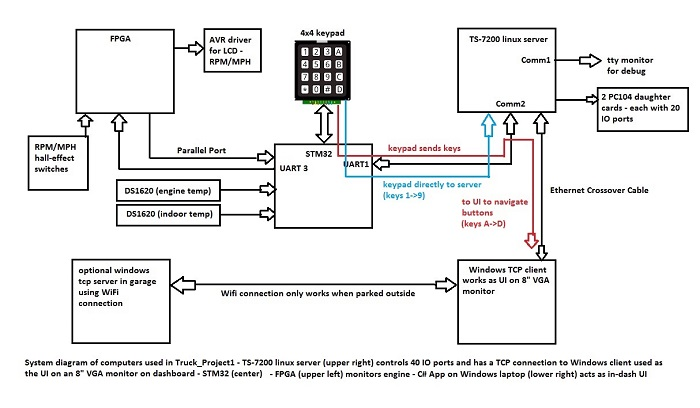

<h1>Truck_Project1</h1>
 
Truck_Project1 is an automotive SCADA system which uses a Xilinx Spartan-3E to  
monitor real-time data, a STM32F100RB to handle a keypad and route message 
traffic, and a TS-7200/7800 to do I/O (turning on and off lights and reading switches). 
The STM32F100RB (STM32) will route message traffic to and from the FPGA, the  
TS-7200 and handle the keypad input. 
 
 
A Windows 10 TCP client runs on a laptop and the VGA port is connected to an external 8" 
monitor in the dash as the UI 
Because the fact that the STM32 has no ethernet connection, and only communicates with 
the TS-7200 via a serial port, the message passing gets really complicated. 
Add to that, the fact that I want to be able to send messages using the keypad as well as 
the Windows client to the TS-7200. 
<h2>Using the keypad</h2>
The keypad buttons, for now, do the basic functions I need: 
<li> '1' - start engine</li>
<li> '2' - stop engine</li>
<li> '3' - brights</li>
<li> '4' - cooling fan</li>
<li> '5' - heater blower</li>
<li> '6' - running lights</li>
<li> '7' - headlamps</li>
<li> '8' - wipers</li>
<li> '9' - not used</li>
<li> '0' - not used</li>
Note: when you press '1' to start the engine, it only powers the relays for the ignition, 
fuel pump, and completes a circuit to a button on the dash to power the starter solinoid. 
The, the code in the TS-7200 only gives you 10 seconds to start the engine. After that, 
the starter solinoid is disabled. 
The 'stop engine' button (2) will turn off the ignition and fuel pump 
The keys: A->D navigate the bottom 10 buttons on the windows client starting with 'Start Engine' 
going down to 'Settings Three', then up to 'Play List' and then down to 'Settings Four'. 
The system will operate without the laptop, but you can only use the numbered buttons on 
the keypad. The messages generated by the lettered buttons are routed to the Windows client 
The buttons labeled 'Test Ports', 'Settings One/Two/Three/Four' call up child dialogs that 
send messages to the TS-7200. The text on the button and the message it sends can be edited 
by changing xml files. 
The messages can be found in https://github.com/sunbelt56/Truck_Project1/mytypes.h 
<h2> The Xilinx processor</h2>
I use a Spartan-3E Xilinx FPGA board to monitor real-time data like engine RPM,MPH. It sends 
data to the STM32 over a parallel port. The STM32 sends data to the FPGA board over a 
RS-232 port and uses handshaking signal. 

There will also be a task to read the ADC's which measure temp sensors and the oil pressure 
(among other things like the photodiode behind the windshield). 
The FPGA has 2 serial ports (transmit only) that send rpm & mph data to a couple of off-the- 
shelf 4 digit LED's that will be on the dashboard. The FPGA also sends the rpm & mph data to 
the PIC via the serial port. 

