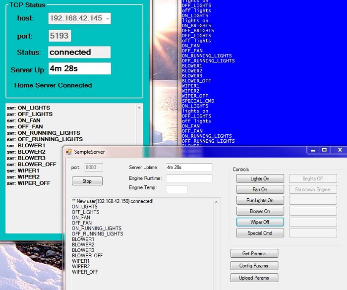

<h1>Truck_Project1</h1>
 
Truck_Project1 is an automotive SCADA system which uses a Xilinx Spartan-3E to  
monitor real-time data, a STM32F100RB to handle a keypad and route message 
traffic, and a TS-7200/7800 to do I/O (turning on and off lights and reading switches). 
The STM32F100RB (STM32) will route message traffic to and from the FPGA, the  
TS-7200 and handle the keypad input. 

 
A Windows 10 TCP client runs on a laptop and the VGA port is connected to an external 8" 
monitor in the dash as the UI 

Because the fact that the STM32 has no ethernet connection, and only communicates with 
the TS-7200 via a serial port, the message passing gets really complicated. 
Add to that, the fact that I want to be able to send messages using the keypad as well as 
the Windows client to the TS-7200. 
<h2>Using the keypad</h2>
The keypad buttons, for now, do the basic functions I need: 
<li> '1' - start engine</li>
<li> '2' - stop engine</li>
<li> '3' - brights</li>
<li> '4' - cooling fan</li>
<li> '5' - heater blower</li>
<li> '6' - running lights</li>
<li> '7' - headlamps</li>
<li> '8' - wipers</li>
<li> '9' - not used</li>
<li> '0' - not used</li>
Note: when you press '1' to start the engine, it only powers the relays for the ignition, 
fuel pump, and completes a circuit to a button on the dash to power the starter solinoid. 
The, the code in the TS-7200 only gives you 10 seconds to start the engine. After that, 
the starter solinoid is disabled. 
The 'stop engine' button (2) will turn off the ignition and fuel pump 
The keys: A->D navigate the bottom 10 buttons on the windows client starting with 'Start Engine' 
going down to 'Settings Three', then up to 'Play List' and then down to 'Settings Four'. 
The system will operate without the laptop, but you can only use the numbered buttons on 
the keypad. The messages generated by the lettered buttons are routed to the Windows client 
The buttons labeled 'Test Ports', 'Settings One/Two/Three/Four' call up child dialogs that 
send messages to the TS-7200. The text on the button and the message it sends can be edited 
by changing xml files. 
<h2>The STM32 processor</h2>
The STM32F100RB is in the subdirectory 'STM32' and was generated using STM32CubeMX and compiled 
with TrueStudio. The project uses FreeRTOS as the operating system. Currently, all but 3 pins 
are used so the next step is to upgrade to a better STM32 chip. 

What's shown here is the pinout that STM32CubeMX reports. I added some user code in the gpio.c 
file that added the pins for the 2 DS1620's. There are sections in the generated code that 
are reserved for user editing. Anything outside these sections gets removed if you pull the 
project back into CubeMX. I had to do it this was because the data pin on the DS1620 is 
changed from input to output. One of the routines generated is a callback for a 1 second 
timer which reads the temp settings to turn the cooling fan on or off according to what the 
DS1620 for engine temp reads. (The DS1620 is mounted on the thermostat housing). The other 
DS1620 is in the cab and reads the indoor temp. A section in the timer callback turns on/off 
the blower for the heater depending on the indoor temp. 
<h2>The Xilinx processor</h2>
I use a Spartan-3E Xilinx FPGA board to monitor real-time data like engine RPM,MPH. It sends 
data to the STM32 over a parallel port. The STM32 sends data to the FPGA board over a 
RS-232 port and uses handshaking signal. Two sensors are connected to the FPGA board which 
are converted to RPM/MPH readings. One sensor comes from a hall-effect switch on the driveshaft 
and another comes from a light sensor on the crankshaft. The FPGA also gets messages from the 
STM32 to generate DTMF tones whenever the keys on the keypad are pushed. The data from the 
RPM/MPH is sent over a parallel port to the STM32 which sends it on to the client and also 
sent to an XMEGA processor over a serial line which drives two LCD displays mounted on the dash. 
<h2> The Home Server</h2>

I'm currently working on another Windows C# app which works just like the client, only it's a TCP 
server which runs on the desktop in the garage and only works when the truck is parked just outside. 
There are 2 network connections on the client. One is threw an ethernet cross-over cable plugged 
directly into the TS-7200 iobox and the other is a WiFi connection. When I start the client app 
on the laptop, I have to connect to the TS-7200 using the top-left button called 'Connect'. 
Then I can close the lid on the laptop, put it under the seat and use the keypad to navigate 
the 10 buttons on the bottom. The button called 'Call Home' will connect to the Home Server 
and then I can go back in the garage and while the engine is warming up, set config parameters 
and control the lights, blower and shut off the engine for what it's worth. The picture shows 
the home server on the lower-right and the status window of the client (running on my desktop) 
on the upper-left. The blue window on the upper-right is just a tty connected to an extra comm port 
on the TS-7200 which just shows debug messages. The messages scrolling on the edit boxes are from 
clicking on the buttons on the home server. The main purpose of the home server is to set configuration 
parameters which get saved to a file on the TS-7200. 

