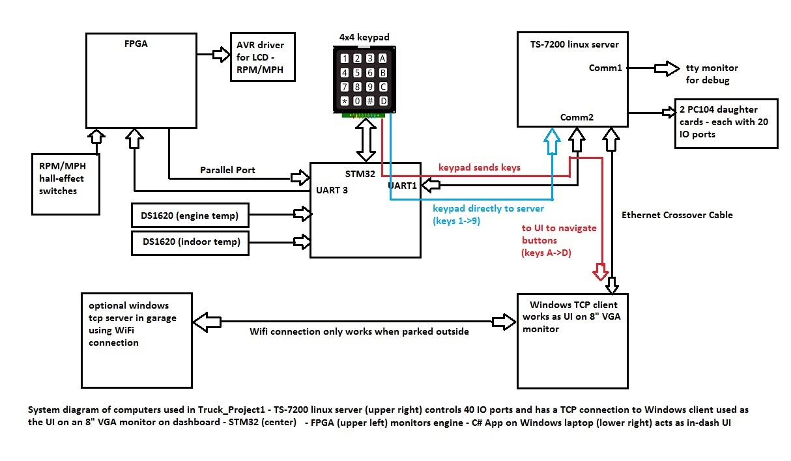

<h1>Truck_Project1</h1>
<br />
Truck_Project1 is an automotive SCADA system which uses a Xilinx Spartan-3E to monitor real-time data,<br />
a STM32F100RB to handle a keypad and route message traffic, and a TS-7200/7800 to do I/O (turning on and<br />
off lights and reading switches). The STM32F100RB (STM32) will route message traffic to and from the FPGA, the <br />
TS-7200 and handle the keypad input.<br />

<br />
A Windows 10 TCP client runs on a laptop and the VGA port is connected to an external 8" monitor in the dash as<br />
the UI.

Because the fact that the STM32 has no ethernet connection, and only communicates with the TS-7200 via a serial port,<br />
the message passing gets really complicated. Add to that, the fact that I want to be able to send messages using the<br />
keypad as well as the Windows client to the TS-7200.<br />
<h2>Using the keypad</h2>
The keypad buttons, for now, do the basic functions I need:<br />
<li> '1' - start engine</li>
<li> '2' - stop engine</li>
<li> '3' - brights</li>
<li> '4' - cooling fan</li>
<li> '5' - heater blower</li>
<li> '6' - running lights</li>
<li> '7' - headlamps</li>
<li> '8' - wipers</li>
<li> '9' - not used</li>
<li> '0' - not used</li>
Note: when you press '1' to start the engine, it only powers the relays for the ignition, fuel pump, and completes a<br />
circuit to a button on the dash to power the starter solinoid. Then, the code in the TS-7200 only gives you 10 seconds<br />
to start the engine. After that, the starter solinoid is disabled. The 'stop engine' button (2) will turn off the ignition<br />
and fuel pump.<br />
The keys: A->D navigate the bottom 10 buttons on the windows client starting with 'Start Engine' going down to<br />
'Settings Three', then up to 'Play List' and then down to 'Settings Four'. The system will operate without the laptop,<br />
but you can only use the numbered buttons on the keypad. The messages generated by the lettered buttons are routed to the<br />
Windows client The buttons labeled 'Test Ports', 'Settings One/Two/Three/Four' call up child dialogs that<br />
send messages to the TS-7200. The text on the button and the message it sends can be edited by changing xml files.<br />
<h2>The STM32 processor</h2>
The STM32F100RB is in the subdirectory 'STM32' and was generated using STM32CubeMX and compiled with TrueStudio.<br />
The project uses FreeRTOS as the operating system. Currently, all but 3 pins are used so the next step is to upgrade<br />
to a better STM32 chip. I added some user code in the gpio.c file that added the pins for the 2 DS1620's. There are<br />
sections in the generated code that are reserved for user editing. Anything outside these sections gets removed if you<br />
pull the project back into CubeMX. I had to do it this way because the data pin on the DS1620 is changed from input to<br />
output. One of the routines generated is a callback for a 1 second timer which reads the DS1620's to turn the cooling<br />
fan on or off according to what the DS1620 for engine temp reads. (The DS1620 is mounted on the thermostat housing).<br />
The other DS1620 is in the cab and reads the indoor temp. A section in the timer callback turns on/off the blower for the<br />
heater depending on the indoor temp.<br />
<h2>The Xilinx processor</h2>
I use a Spartan-3E Xilinx FPGA board to monitor real-time data like engine RPM,MPH. It sends data to the STM32 over a<br />
parallel port. The STM32 sends data to the FPGA board over a RS-232 port and uses handshaking signal. Two sensors are<br />
connected to the FPGA board which are converted to RPM/MPH readings. One sensor comes from a hall-effect switch on the<br />
driveshaft and another comes from a light sensor on the crankshaft. The FPGA also gets messages from the STM32 to generate<br />
DTMF tones whenever the keys on the keypad are pushed. The data from the RPM/MPH is sent over a parallel port to the STM32<br />
which sends it on to the client and also sent to an XMEGA processor over a serial line which drives two LCD displays<br />
mounted on the dash.<br />
<h2> The IO box (TS-7200)</h2>

I'm using a TS-7200 embedded linux card from Technologic which has a PC-104 card connector. (shown on left)<br />
The card runs linux compiled for the ARM processor on the card. When it gets powered up, it automatically<br />
starts an app called 'sched' which uses POSIX threads and runs as a TCP/IP server. The ethernet port is<br />
extended to an RJ-45 socket on the outside of the box where the cross-over cable plugs into.<br />
The picture on the right shows the 2 PC-104 IO cards mounted on top of it. Each card has 20 input and output<br />
ports; The outputs are the small 5A relays, 10 on each side, and the inputs come from the grey ribbon cable.<br />
The outputs of the small 5A relays go to other 10A relays which control low voltage 12Vdc circuits like the<br />
running lights and blinkers, while the higher amperage circuits like the headlights and starter solinoid are<br />
controlled by 10-30A cube relays. The serial port next to the ethernet port goes to the STM32. So there is no<br />
way to upload a new sched program to the iobox because on the bench, I have to ftp into it from another linux<br />
desktop. When it's in the vehicle, I have to use a Windows app called 'SendFiles' which makes an FTP connection<br />
to the linux server after the sched program exits with a special code. There is another ARM compiled program<br />
on the linux server called 'server' which downloads the new sched program from the SendFiles program running<br />
on the client. After downloading, the system is rebooted. This is all handled by a bash script in the sched<br />
directory called 'try_sched.sh' which gets called when the linux card boots up. So if I make a change to the<br />
client where the message list is different and try to run it before uploading the new sched, I have to pull<br />
it in the garage and move a linux desktop inside and ftp into it.<br />
There is also an 2 line LCD screen (not shown) on the iobox that scrolls the messages that come to the sched.<br />
<h2>The LCD screen</h2>

I originally was using a t6963 LCD screen with an AVR Pro-Mini on the back of it which got serial commands<br />
from UART2 of the STM32. I was trying to do some kind of user input from the keypad which got too problematic<br />
so I went to using the Windows laptop as the UI. This is not show on the system diagram at the top, but I will<br />
have to, at some point re-install it when I start running out of room to display RT data on the Windows screen.<br />
All the code for the AVR processor is in the AVR_t6963 directory. At one time I had a PWM signal coming from<br />
the FPGA board which would dim the LCD screen.<br />
<h2>The Home Server</h2>

I'm currently working on another Windows C# app which works just like the client, only it's a TCP<br />
server which runs on the desktop in the garage and only works when the truck is parked just outside.<br />
There are 2 network connections on the client. One is threw an ethernet cross-over cable plugged<br />
directly into the TS-7200 iobox and the other is a WiFi connection. When I start the client app<br />
on the laptop, I have to connect to the TS-7200 using the top-left button shown as 'Disconnect'.<br />
(The text for this button says 'Connect Server' when not connected to linux server, or 'Disconnect<br />
when connected). Then I can close the lid on the laptop, put it under the seat and use the keypad to<br />
navigate the 10 buttons on the bottom. The button called 'Call Home' will connect to the Home Server<br />
and then I can go back in the garage and while the engine is warming up, set config parameters<br />
and control the lights, blower and shut off the engine for what it's worth. (Also monitor the temps).<br />
The picture shows the home server on the lower-right and the status window of the client (running on my desktop)<br />
on the upper-left. The blue window on the upper-right is just a tty connected to an extra comm port<br />
on the TS-7200 which just shows debug messages. The messages scrolling on the edit boxes are from<br />
clicking on the buttons on the home server. The main purpose of the home server is to set configuration<br />
parameters which get saved to a file on the TS-7200.<br />
<h2>Configuration Parameters</h2>

The 3 buttons on the lower-right of the home server are used to manage the configuration parameters.<br />
The 'Get Params' button gets the parameters from the param.conf file which stores the params on disk(TS-7200).<br />
The 'Config Params' button pulls up a dialog (show above) on the home server where the user can modify the<br />
params. The 'Upload Params' button loads the params needed by the STM32 to control the cooling and heater fan.<br />
Namely, the temperatures on the left. There is also a way to set the params on the Windows client.<br />
<h3>List of config params on TS-7200</h3>
<li>rpm_update_rate</li>
<li>mph_update_rate</li>
<li>fpga_xmit_rate</li>
<li>high_rev_limit</li>
<li>low_rev_limit</li>
<li>cooling_fan_on</li>
<li>cooling_fan_off</li>
<li>blower_enabled</li>
<li>blower1_on</li>
<li>blower2_on</li>
<li>blower3_on</li>
<li>lights_on_delay</li>
<li>engine_temp_limit</li>
<li>batt_box_temp</li>
<li>test_bank</li>
The update rates are not implemented yet, but will control how fast the RPM/MPH data is sent to the displays.<br />
The high/low rev limit are for the rev limiter.<br />
The cooling fan on/off determine at what engine temps the cooling fan goes on or off. Hopefully the fan on is higher<br />
than the fan off.<br />
The blower_enabled is the engine temp at which the STM32 even responds to the indoor temps to control the heater.<br />
The blower1_on is the highest indoor temp at which the blower runs on low speed.<br />
The blower2_on is the medium speed temperature.<br />
The blower3_on is the highest speed temperature.<br />
So the blower will come on high speed when the indoor temp is below what the blower3_on temp is set to.<br />
The blower will switch to medium speed when the indoor temp reaches blower2_on temp, and will switch to<br />
low speed when the indoor temp is between blower1_on and blower2_on, and finally go off when above blower1_on.<br />
The lights on delay is how many seconds the lights/running lights stay on after the engine shuts off.<br />
The TS-7200 actually uses this value to also shut off the blower motor too.<br />
The engine_temp_limit is the engine temperature at which an alarm sounds. Currently the engine doesn't shut<br />
down at too high a temp, but at some point in the future it should, along with the oil pressure which isn't hooked up yet.<br />
The battery box temp is for the heat strip underneath the battery which is behind the passenger seat.<br />
<h2>More about the Windows Client</h2>

The buttons labeled: 'Test Ports', 'Settings One/Two/Three/Four' call up a child dialog which works the same with<br />
the A->D keys on the keypad as they do on the main screen of the client screen. 'A' moves up, 'B' moves down, '*' moves<br />
to the opposite column, 'C' executes whatever the key applies to, and 'D' closes or exits. Each button on the main<br />
screen are assigned an xml file, so I can edit the name of each button on the child dialog and what it does as far as<br />
what message it passes to the linux server. So the 3rd button down on the right labeled 'Lights On/Off' will toggle the<br />
headlights on and off. There is another type of child dialog that is set by xml files which is a scrolling list of values<br />
to choose from. Most of the scrolling list dialogs are used to set the config parameters.<br />
<h2>More on the IO box (TS-7200)</h2>
The sched program starts with a command line param called odata.dat which is a database of all the io settings.<br />
There are 40 records in the database. Currently the fields for each record are:
<li>port</li>
<li>onoff</li>
<li>input_port</li>
<li>type</li>
<li>time_delay</li>
<li>label</li>
<br />
The label field is:<br />
<li>STARTER</li>
<li>ACCON</li>
<li>FUELPUMP</li>
<li>COOLINGFAN</li>
<li>LHEADLAMP</li>
<li>RHEADLAMP</li>
<li>RUNNINGLIGHTS</li>
<li>LIGHTBAR</li>
<li>LEFTRBLINKER</li>
<li>RIGHTRBLINKER</li>
<li>LEFTFBLINKER</li>
<li>RIGHTFBLINKER</li>
<li>LBRAKELIGHT</li>
<li>RBRAKELIGHT</li>
<li>XLBLINKER</li>
<li>XRBLINKER</li>
<li>LBRIGHTS</li>
<li>RBRIGHTS</li>
<li>HTRBLOWERLOW</li>
<li>HTRBLOWERMED</li>
<li>HTRBLOWERHIGH</li>
<li>WWIPER1</li>
<li>WWIPER2</li>
(rest not used)<br />
The port is always 0->39, the onoff is not used, the input_port is the input that applies to the output,<br />
for instance, the input types for LHEADLAMP and RHEADLAMP are 0 because the switch to turn the headlights<br />
on is connected to the 1st input port on the first IO card. The type determines how the output behaves<br />
when it's activated.<br />
<li>0) regular - on/off state responds to assigned input (affected_output)</li>
<li>1) goes on/off and stays that way until another on/off</li>
<li>2) on for time_delay seconds and then it goes back off</li>
<li>3) goes on/off every second until time_delay is up</li>
<li>4) if on, turn off and wait for msg (serial or tcp) to turn back on</li>
<li>6) goes on/off at pulse_time rate in 10ths of a second then	goes off when time_delay is up</li>
<li>7) goes on/off at pulse_rate in 10ths of a second if onoff is active only</li>
(type 6 & 7 not implemented yet)<br />
The time_delay only applies to types 2 & 3 (used by blinkers).<br />
Notice I have an output assigned to (4) blinkers. The reason for this stems from the fact that on most older<br />
vehicles, the tail light bulb works for both the brakes and blinkers. I had to do a special work-around by<br />
adding 2 outputs called XLBLINKER and XRBLINKER.<br />

The type for the 4 blinkers are 3 and the type for the 2 Xblinkers are type 2. So when the brakes are applied<br />
and one of the blinkers is on, the blinker will still work. (Hope that explains it).<br />
<h3>mingetty & try_sched.sh</h3>
(Warning: not for the faint of heart)<br />
I had to compile a c program called mingetty.c for the ARM compiler which can be downloaded online.<br />
Then I had to modify some files in the /etc directory.<br />
The directory in /etc/rc.d has the directories: rc0.d->rc6.d which have bash scripts which gets executed<br />
in order when linux boots.<br />

 the directory: rc.d/rc3.d has links to startup scripts in /etc/init.d<br />

Then in /etc/init.d, I place 'my_startup.sh which is just a switch/case statement with 'start' and 'stop'<br />
Under 'start' it just does:<br />
cd /home/dan/dev/sched # change directory to where the try_sched.sh gets executed<br />
./try_sched.sh # execute the try_sched.sh script<br />
'my_startup.sh':<br />
This script is in /etc/init.d<br />

What this does is, everytime the linux card is turned on or rebooted, try_sched.sh get executed.<br />

```
echo "running try_sched.sh (v1.14)" >> status.txt
date >> status.txt
if [ ! -e /mnt/cf/temp.txt ]
then
 ../mountcf.sh
 echo "mounting cf"
fi

if [ -e /root/sched ]
then
 mv /root/sched sched
 chmod +x sched
 echo "new sched found in /root" >> status.txt

else if [ -e sched2 ]
then
 mv sched2 sched
 chmod +x sched
 echo "new sched found (sched2)" >> status.txt
else
 echo "using current sched" >> status.txt
fi
fi

./sched odata.dat
OUT=$?
echo "OUT:" >> status.txt
echo $OUT >> status.txt
date >> status.txt

if [ $OUT -eq 1 ]
 then
  echo "exit to shell" >> status.txt
fi

if [ $OUT -eq 2 ]
 then
  echo "rebooting from script" >> status.txt
 /sbin/reboot
fi 

if [ $OUT -eq 3 ]
 then
  echo "shutdown from script" >> status.txt
/sbin/shutdown -h now
fi

if [ $OUT -eq 4 ]
 then
  echo "downloading new try_sched.sh" >> status.txt
  ./server >> status.txt
  ./sched2 test 1
  OUT=$?

if [ $OUT -eq 10 ]
  then
   echo "download ok" >> status.txt
   mv sched2 sched
   chmod +x sched
   /sbin/reboot
else 
 echo "bad download" >> status.txt
  rm sched2
  /sbin/reboot
fi
fi

if [ $OUT -eq 141 ]
 then
  echo "rebooting from 141" >> status.txt
fi

if [ $OUT -eq 139 ]
 then
  echo "rebooting from 139" >> status.txt
fi
```

What this does is first, it mounts the flash drive if the file 'temp.txt' exists.<br />
Then, it checks to see if sched is in /root, moves it to the current directory, sets the exec flag<br />
and the goes to the './sched odata.dat which executes the sched program.<br />
If there is not sched in root, it checks to see if there is a 'sched2' in the current directory<br />
and changes the name to sched, sets the execute flag and executes it. The 'sched2' is what gets<br />
uploaded by the 'SendFiles' and server program when the client exits with a code '4'.<br />

```
if [ $OUT -eq 4 ]
 then
  echo "downloading new try_sched.sh" >> status.txt
  ./server >> status.txt
  ./sched2 test 1
  OUT=$?
```

There is a few lines of code in the very beginning of the sched program that checks if there were<br />
3 command line params passed to it:<br />

```
else if(argc == 3)
{
	if((strcmp(argv[1],"test") == 0))
	{
		printf("testing\r\n");
	}
	printf("%s\r\n",argv[1]);
	return 10;
}
```

The 2nd one being the string: 'test'. This way, we can check to see if a valid sched has been uploaded.<br />
Otherwise, it goes to 'bad download', deletes the sched2 and reboots. If the sched returns a code '10'<br />
when the 'test' string is passed in, it means the file is valid so it renames sched2 to sched, sets the<br />
execute flag and reboots.<br />
The other exit codes pertain to what happens when you go to the 'Manage Server' button on the top left<br />
of the client screen.<br />

The 'Reboot Server' button tells the sched program to exit with a code '2', The 'Shutdown' button tells<br />
the sched to exit with a code '3' and the 'Upload New' button makes the sched exit with a '4'.<br />
(Exit to Shell will just make the sched quit and if you are not hooked up to comm1 with a tty,<br />
then you're out of luck, and will have to do a reset.)<br />
At the very end of 'sched.c', when the program exits, a global variable called: 'reboot_on_exit' gets set<br />
to the exit code sent by the client:<br />

```
	if(reboot_on_exit == 1)
	{
//		printf("sched: exit to shell\r\n");
		return 1;
	}
	else if(reboot_on_exit == 2)
	{
//		printf("sched: reboot\r\n");

		return 2;
	}
	else if(reboot_on_exit == 3)
	{
//		printf("sched: shutdown\r\n");
		return 3;
	}
	else if(reboot_on_exit == 4)
	{
//		printf("doing upload new\r\n");
		return 4;
	}
```

<h2>Some highlights of sched</h2>
The thread_io directory has all the files used to compile the sched program. The 'Makefile' uses the ARM<br />
cross-compiler to compile for the particular ARM processor the TS-7200 uses. The 3 main c files are:<br />
sched,c tasks.c and cmd_tasks. The sched.c file is where the 'main()' function is and creates some POSIX<br />
threads specified in 'tasks.h':<br />

```
enum task_types
{
	GET_HOST_CMD,
	MONITOR_INPUTS,
	MONITOR_INPUTS2,
	TIMER,
	TIMER2,
	BUTTONS,
	TCP_MONITOR,
	SERIAL_RECV,
	BASIC_CONTROLS
} TASK_TYPES;
```

The function for the GET_HOST_CMD thread is in cmd_tasks,c and is a huge switch/case that gets messages<br />
from the TCP connection. If the Windows client is not connected, this section gets skipped over.<br />
The other tasks are in tasks.c.<br />
The MONITOR_INPUTS task just waits for something to change on the input ports of the IO cards.<br />
The MONITOR_INPUTS2 task is a way to programmatically inject 'fake inputs' to the system so it thinks<br />
the input ports have changed. The TIMER_TASK is a task that gets called once a second. The SERIAL_RECV<br />
task gets command from the STM32. The BASIC_CONTROLS task waits on a queue for messages and controls<br />
the output ports. 

